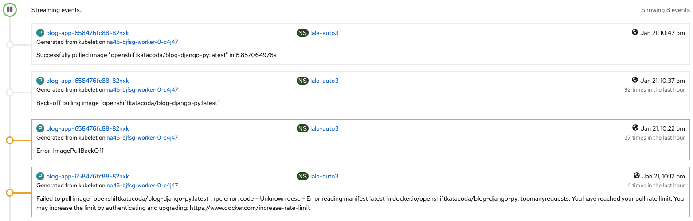

# fiap-6asoo-ocp

This project was the delivery for the Solution Sprint in the *Phase 4 - Containerization Strategy* of the Solutions Architecture MBA at FIAP.

## Notes

- The secrets present on _database/secret.yaml_ are just for studying purposes. It must *never* be done this way in any real scenarios (even for dev, qa or related environments).

## How to test it

Run:
- git clone https://github.com/LcsK/fiap-6aso-ocp.git
- cd fiap-6aso-ocp
- oc apply -k ./
- Access `http://group25-blog.apps.na46.prod.nextcle.com/`

## Running on Red Hat Academy environment

You may face the _"Failed to pull image"_ error, but it is a error on Red Hat Academy environment, and it may work after some time:

